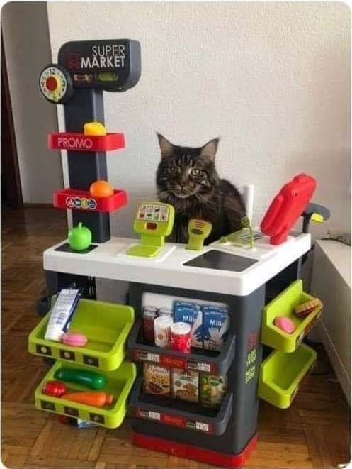

# Simulador de Supermercado con Multihilos en C#

Este proyecto es una aplicación de escritorio desarrollada en C# que simula un supermercado con dos cajas de pago, utilizando múltiples hilos (multihilos) para atender a una cantidad determinada de personas de manera simultánea.

## Descripción

El simulador representa un escenario donde los clientes llegan al supermercado y se distribuyen entre dos cajas para ser atendidos. Se emplean múltiples hilos para simular la concurrencia en el proceso de atención a los clientes, mostrando cómo funciona el manejo de hilos en C#.

## Funcionalidades

La aplicación ofrece las siguientes funcionalidades:

- **Dos Cajas de Pago:** Los clientes son distribuidos entre dos cajas simuladas para su atención.
- **Atención Concurrente:** Utiliza multihilos para atender a múltiples clientes de manera simultánea.
- **Clientes Aleatorios:** Genera una cantidad aleatoria de clientes y simula su llegada al supermercado.
- **Visualización en Tiempo Real:** Muestra en tiempo real cómo se van atendiendo a los clientes en las cajas.

## Uso

1. **Ejecución del Programa:** Inicia la aplicación.
2. **Observación de la Simulación:** Observa cómo los clientes son asignados a las cajas y atendidos en paralelo.
3. **Resultados:** Al finalizar, la aplicación muestra estadísticas de tiempos de espera y atención de los clientes.

## Requisitos

- **Entorno de Desarrollo Integrado (IDE):** Se recomienda Visual Studio o cualquier IDE compatible con C#.
- **Sistema Operativo Windows:** La aplicación está diseñada para ejecutarse en sistemas Windows.